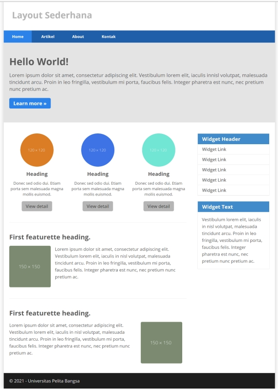
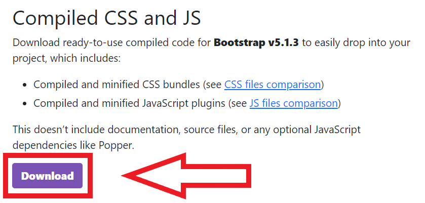
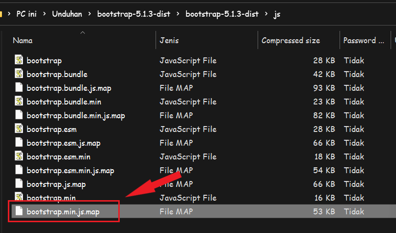
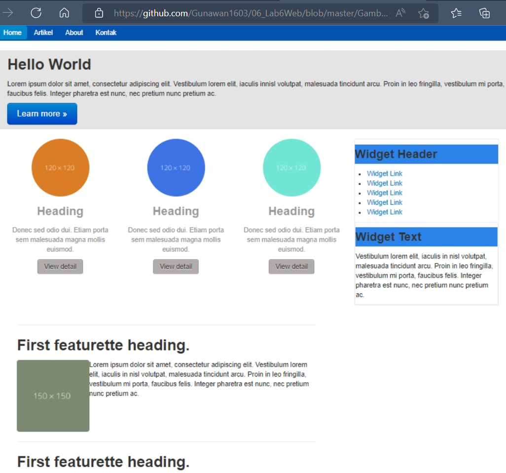

TUGAS PERTEMUAN 7

PEMROGRAMAN WEB

TEKNIK INFORMATIKA

UNIVERSITAS PELITA BANGSA

NAMA : Arip Hidayattuloh

NIM : 312010244

KELAS : TI.20.B1

DOSEN : Agung Nugroho,S.Kom.,M.Kom

# Pemrograman Web: css frameword (Twitter Bootsrtap)

## Instruksi Praktikum

1. Persiapkan text editor misalnya VSCode.

2. Buat folder baru dengan nama lab6_css_framework

3. Buat file baru dokumen html

4. Buat struktur dasar dari dokumen HTML.

5. Buatlah layout web sederhana menggunakan css frameword (Twitter Bootsrtap).

6. Lakukan validasi dokumen html dengan mengakses http://validator.w3.org

## Berdasarkan gambar layout web berikut, buatlah menggunakan Twitter Bootstrap.

 

## Langkah 1: Buat Direktori Baru Kemudian Download Bootstrap

Kemudian download Bootstrap dari website resminya.https://getbootstrap.com/



Setelah proses download selesai, Anda akan mendapatkan file zip dengan beberapa folder di dalamnya.

Di dalam folder ini terdapat beberapa file yang terkumpul ke dalam beberapa assets dan menyediakan beberapa fungsi dan class di dalamnya. File zip ini nantinya perlu Anda ekstrak terlebih dahulu ke dalam folder project supaya dapat digunakan.

## Langkah 2: Ekstrak File Bootstrap

Setelah Anda memindahkan file zip tadi ke dalam folder project, ekstrak file tersebut di dalamnya.



Copy file bootstrap.min.css yang berada di folder css dan bootstrap.min.js yang berada di folder js.

## Langkah 3: Buat Sebuah File Index.html

Buat file index.html. Di dalam file lab6_css_framework isikan beberapa baris kode, tapi jangan lupa untuk memanggil file Bootstrap dan library lainnya.

Memasukkan style sheet yang diperlukan yaitu bootstrap.css .

```
<link rel="stylesheet" href="bootstrap.min.css">
```

Memasukkan file JavaScript yang diperlukan.`
```
<script src="bootstrap.bundle.min.js" type="text/javascript"></script>
```

Berikut Code HTLM :
```
<!DOCTYPE html>
<html lang="en">
<head>
  <meta charset="UTF-8">
  <meta http-equiv="X-UA-Compatible" content="IE=edge">
  <meta name="viewport" content="width=device-width, initial-scale=1.0">
  <title>Layout Sederhana</title>
  <link rel="stylesheet" href="bootstrap.min.css">
  <script src="bootstrap.bundle.min.js" type="text/javascript"></script>
</head>
<body>
</body>
</html>
```
Berikut kode HTML CSS frameword (Twitter Bootsrtap) :

```
<!DOCTYPE html>
<html lang="en">
<head>
  <meta charset="UTF-8">
  <meta http-equiv="X-UA-Compatible" content="IE=edge">
  <meta name="viewport" content="width=device-width, initial-scale=1.0">
  <title>Layout Sederhana</title>
  <link rel="stylesheet" href="bootstrap.min.css">
  <script src="bootstrap.bundle.min" type="text/javascript"></script>
   
</head>
<body>
  <header>
  <div class="container-fluid">
      <h1 class="text-Left" style="color: #b5b5b5;">Layout Sederhana</h1>
    </div>
    </header>
        <div class="bg-info text-white">
        <div class="card text-center" style="background: #0353ae;">
          <div class="card-header">
            <ul class="nav nav-pills card-header-pills">
              <li class="nav-item active" style="enable-background: #2b83ea;">
                <a class="home.html" aria-current="true" href="#">Home</a>
              </li>
              <li class="nav-item" style="enable-background: #2b83ea;">
                <a class="artikel.html" href="#"style="color: #ffffff;">Artikel</a>
              </li>
              </li>
              <li class="nav-item" style="enable-background: #2b83ea;">
              <a class="about.html" href="#" style="color: #ffffff;">About</a>
              </li>
              </li>
              <li class="nav-item" style="enable-background: #2b83ea;">
              <a class="kontak.html" href="#" style="color: #ffffff;">Kontak</a>
          </div>
        </div>
        <div class="container-fluid" style="background-color: #e4e4e5">
          <section id="hero">
            <h2>Hello World</h2>
            <p>Lorem ipsum dolor sit amet, consectetur adipiscing elit. Vestibulum lorem
              elit, iaculis innisl volutpat, malesuada tincidunt arcu. Proin in leo fringilla,
              vestibulum mi porta, faucibus felis. Integer pharetra est nunc, nec pretium nunc
              pretium ac.</p>
              <p><a class="btn btn-primary btn-large">Learn more &raquo;</a></p></a>
          </div>
        </div>
        </div>
      </div>
    </section>
    <br>
    <div class="container-fluid">
    <div class="row">
        <div class="span3">
          <div class="box">
            <center></center>
            <h3 class="muted text-center">Heading</h3>
            <p class="muted text-center">Donec sed odio dui. Etiam porta sem malesuada magna mollis
            euismod.</p>
            <center><a href="#" class="btn btn-default" style="background: #b0acac">View detail</a></center>
            </div>
      </div>
        <div class="span3">
          <div class="box">
            <center></center>
            <h3 class="muted text-center">Heading</h3>
            <p class="muted text-center">Donec sed odio dui. Etiam porta sem malesuada magna mollis
            euismod.</p>
            <center><a href="#" class="btn btn-default" style="background: #b0acac">View detail</a></center>
            </div>
      </div>
      <div class="span3">
        <div class="box">
          <center></center>
          <h3 class="muted text-center">Heading</h3>
          <p class="muted text-center">Donec sed odio dui. Etiam porta sem malesuada magna mollis
          euismod.</p>
          <center><a href="#" class="btn btn-default" style="background: #b0acac">View detail</a></center>
          </div>
    </div>
    
   <div class="span4" style="right: auto;">
     <aside id="sidebar">
     <div class="widget-box" style="border: 1px solid #eee;margin-bottom:20px;">
       <h3 class="title" style="list-style-type:none;border-bottom:1px solid #eee;background-color: #2b83ea;">Widget Header</h3>
       <ul>
       <li><a href="#">Widget Link</a></li>
       <li><a href="#">Widget Link</a></li>
       <li><a href="#">Widget Link</a></li>
       <li><a href="#">Widget Link</a></li>
       <li><a href="#">Widget Link</a></li>
       </ul>
   <div class="widget-box" style="border: 1px solid #eee;">
     <h3 class="title" style="background-color: #2b83ea;">Widget Text</h3>
     <p>Vestibulum lorem elit, iaculis in nisl volutpat, malesuada tincidunt
     arcu. Proin in leo fringilla, vestibulum mi porta, faucibus felis. Integer
     pharetra est nunc, nec pretium nunc pretium ac.</p>
     </div>
   </div>
 </aside> 
</div>
</div>
<div class="span8">
    <hr class="divider" />
                  <article class="entry">
                  <h2>First featurette heading.</h2>
                  
                  <p>Lorem ipsum dolor sit amet, consectetur adipiscing elit. Vestibulum lorem
                  elit, iaculis in nisl volutpat, malesuada tincidunt arcu. Proin in leo fringilla,
                  vestibulum mi porta, faucibus felis. Integer pharetra est nunc, nec pretium nunc
                  pretium ac.</p>
                  </div>
                 </article>
                 <div class="span8">
                 <hr class="divider" />
                    <article class="entry">
                    <h2>First featurette heading.</h2>
                    
                    <p>Lorem ipsum dolor sit amet, consectetur adipiscing elit. Vestibulum lorem
                    elit, iaculis in nisl volutpat, malesuada tincidunt arcu. Proin in leo fringilla,
                    vestibulum mi porta, faucibus felis. Integer pharetra est nunc, nec pretium nunc
                    pretium ac.</p>
                 </article>
                </div>
              </div>
            </section>
            <br>
            <div class="container-fluid" style="background-color: #1d1d1d; padding:20px;
            color:#eee;">
          <footer>
              <p>&copy; 2021 - Universitas Pelita Bangsa</p>
          </footer>
      </div>
    </div>
</body>
</html>
```

 
